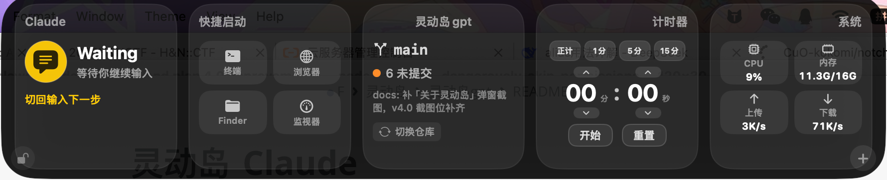

# 灵动岛 Claude

一个为 MacBook Notch 设计的 Claude Code 状态悬浮面板，收起时贴合 notch 显示简洁状态，鼠标悬停展开为可自由组合的信息面板。

## 效果

| 收起态 | 展开态 |
|--------|--------|
|  |  |

- **收起态**：贴合屏幕顶部 notch，显示 Claude Code 实时状态 + 计时器进度
- **展开态**：鼠标悬停展开，显示用户自选的 2-6 个组件，支持拖拽排序

## v4.0 新特性

- **细化 Claude 状态**：运行中显示当前工具与目标 + 实时耗时（如 `Edit · App.swift · 12s`），收起态与展开态都能看清 Claude 在做什么
- **走开即用**：任务完成 / 需要授权 / 出错时发系统通知 + 提示声音，离开电脑也不会错过交回时机
- **完成动画**：任务交回瞬间，notch 整条绿光脉冲 + 图标弹出绿色对勾「完成」，随后平滑还原状态（尊重系统「减弱动态效果」）
- **菜单开关**：右键面板可单独开关「完成通知」与「提示声音」
- **关于与更新**：右键「关于灵动岛」查看介绍与版本，一键从 GitHub 检查最新版本
- **自动装/升级 hook**：每次启动自动检测并安装/升级 Claude Code hook，无需手动重跑脚本；合并式写入，**不会清除其它工具（如 Clawd on Desk）的 hook**

### v4.0 效果预览

| 细化状态（运行中） | 完成动画（绿光 + 双勾） | 关于 & 检查更新 |
|--------------------|------------------------|-----------------|
|  |  |  |

<!--
截图占位：把对应图片放到 record/ 下同名文件即可自动显示（*.png 已可直接提交）。
  record/v4-status.png    收起态显示「工具 · 目标 · 耗时」，如 App.swift  12s
  record/v4-complete.png  任务完成时整条绿光脉冲 + 左右绿色对勾 +「完成」
  record/v4-about.png     右键「关于灵动岛」弹窗（介绍 + 版本 + 检查更新）
-->


## v3.0 新特性

- **模块化组件系统**：14 个组件自由组合，拖拽排序，拖出删除
- **组件管理面板**：图标化布局，左侧添加右侧删除
- **窗口自适应**：面板宽度根据组件数量动态伸缩
- **锁定模式**：左下角锁定按钮，锁住后面板不会收回

## 组件列表

| 组件 | 功能 |
|------|------|
| Claude 状态 | Claude Code 运行状态实时监控 |
| 日历 | 当月月历，今天高亮 |
| 计时器 | 正计时/倒计时，快捷预设，分秒独立调节 |
| 系统监控 | CPU、内存、上传/下载网速 |
| 天气 | 当前温度、天气状况、所在城市（中文） |
| 电池 | 电量百分比、充电状态、剩余时间 |
| 音乐 | 当前曲目、播放控制（支持 Spotify / Apple Music） |
| Git | 当前分支、未提交数、最近 commit，可选择仓库 |
| 端口监控 | 本地常用端口活跃状态 |
| Docker | 容器运行状态 |
| 剪贴板 | 最近 5 条复制记录，点击重新复制 |
| 番茄钟 | 25 分钟专注 + 休息循环 |
| 音量 | 系统音量滑块，点击图标静音 |
| 快捷启动 | 一键打开终端/浏览器/Finder/活动监视器 |

## 安装

### 方式一：DMG 安装（推荐）

从 [Releases](../../releases) 下载 `NotchClaude.dmg`，打开后将 `NotchClaudeApp.app` 拖入 `Applications` 即可。首次启动 App 会自动配置 / 升级 Claude Code hook（合并式写入，不影响其它工具的 hook），无需手动运行脚本。

### 方式二：从源码构建

```sh
git clone https://github.com/CuO-kokomi/notch-claude-app.git
cd notch-claude-app
chmod +x build.sh && ./build.sh
# 将生成的 NotchClaudeApp.app 拖入 /Applications
```

### 配置 Claude Code 状态同步

运行一次安装脚本，自动写入 hooks 到 `~/.claude/settings.json`：

```sh
./install-claude-hooks.sh
```

脚本会：
- 安装 / 升级 `~/.claude/hooks/notch-status.sh`（带版本标记，自动识别旧版本并升级）
- 以**合并方式**在 `~/.claude/settings.json` 中追加 SessionStart / PreToolUse / PostToolUse / Notification / Stop 等 hook 事件，保留其它工具已有的 hook

> v4.0 起，App 每次启动会自动检测并安装/升级 hook，通常无需手动运行此脚本。

重启 Claude Code 或打开 `/hooks` 一次即可生效。

## 操作

- **鼠标悬停 notch 区域**：展开面板
- **鼠标移走**：自动收起（锁定模式下保持展开）
- **拖拽组件**：左右拖拽排序，上下拖出删除
- **右下角 + 按钮**：进入组件管理，添加新组件
- **左下角锁定按钮**：锁定/解锁面板展开状态
- **右键面板**：重置 Claude 状态 / 贴顶显示 / 完成通知开关 / 提示声音开关 / 退出

## 兼容性

- macOS 13.0+
- 带 notch 的 MacBook（非 notch 机型也能用，只是位置靠近屏幕顶部中央）

## 技术栈

- SwiftUI + AppKit，无第三方依赖
- 模块化 Widget 注册表架构
- `NSPanel` borderless / nonactivating
- Claude Code hooks → 本地 JSON → Swift 轮询
- MediaRemote 私有框架读取 Now Playing
- CoreAudio 音量控制
- IOPowerSources 电池状态
- Mach API 读取 CPU/内存
- `getifaddrs` 网络接口字节数计算网速

## 反馈与联系

如有问题、建议或想参与贡献，欢迎提 [Issue](../../issues) 或联系我：

> chenkokomicuo@gmail.com

## 许可

MIT
