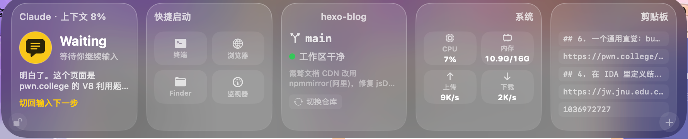
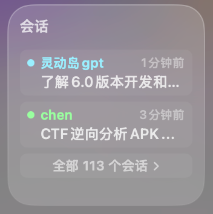
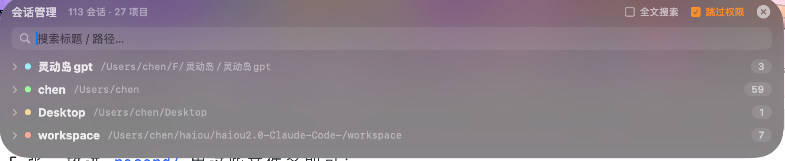
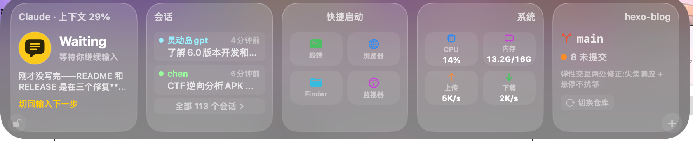
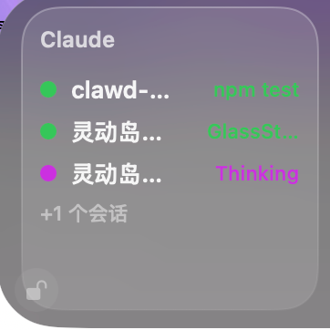
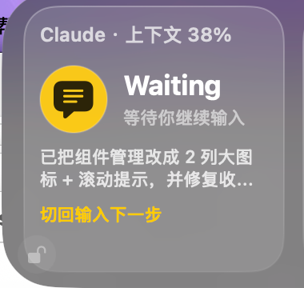
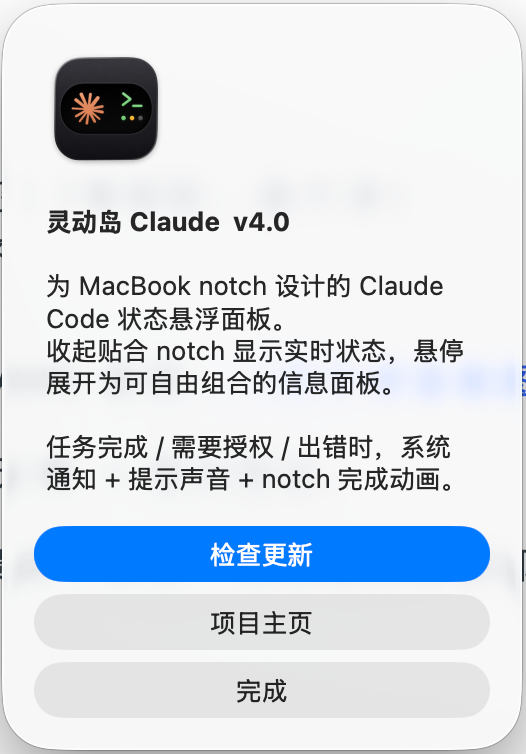

# 灵动岛 Claude

一个为 MacBook Notch 设计的 Claude Code 状态悬浮面板，收起时贴合 notch 显示简洁状态，鼠标悬停展开为可自由组合的信息面板。

## 效果

| 收起态 | 展开态 |
|--------|--------|
|  |  |

- **收起态**：贴合屏幕顶部 notch，显示 Claude Code 实时状态 + 计时器进度
- **展开态**：鼠标悬停展开，显示用户自选的 2-6 个组件，支持拖拽排序

## v6.0 新特性

- **会话管理（ccsm 集成）**：刘海从"看当前会话状态"升级为"管理所有会话的入口"。新增「会话」组件显示最近会话，点击即在新终端窗口 `claude --resume` 恢复；点「全部 N 个会话」面板切换为完整**会话管理模式**——所有历史会话按项目分组（项目名 + 路径 + 数量徽标），显示标题 / 首条消息 / 分支 / 消息数 / 时间，一键恢复
- **面板内直接搜索**：会话管理模式带搜索框（面板首次支持键盘输入，Spotlight 式成为焦点但不激活 app，退出后键盘自动还给原 app），即时过滤标题 / 路径；勾选「全文搜索」可搜会话正文内容（装了 ripgrep 自动加速，没装走内置搜索）；Esc 或右上角 ✗ 退出
- **跳过权限恢复**：勾选「跳过权限」后 resume 附加 `--dangerously-skip-permissions`，选择持久化
- **多终端支持**：右键菜单「会话打开终端」选择 resume 用哪个终端——Terminal / Otty / iTerm2 / Ghostty / kitty / Alacritty / WezTerm，只列已安装的，卸载后自动回退 Terminal
- **项目色**：每个项目从路径哈希出一个稳定的粉彩强调色，会话组件行首圆点 + 项目名、管理页分组头同色呼应，多项目扫一眼即可区分
- **全组件语义色**：一个组件一个语义色、只点信号不点底色——系统监控四图标（CPU 蓝 / 内存紫 / 上传橙 / 下载绿）、计时器运行态薄荷绿、日历今天所在列橙、天气图标系统多色、音乐播放键品牌色（Spotify 绿 / Apple Music 红粉）、Git 分支图标品牌橙、端口号青、Docker 品牌蓝、番茄钟数字跟随相位色、快捷启动四图标各自着色；会话列表 hover 高亮反馈可点性

### v6.0 修复

- **终端先回答权限后刘海卡片不消失**：新版 Claude Code 在终端回答后不再断开挂起的 hook 连接，导致刘海一直显示待审批。改为用会话状态兜底判定——请求所属会话的状态被推进且不再是「需授权」即自动撤卡
- **CPU 使用率显示的是开机平均值**：原实现直接用开机以来的累计 tick 算占比，得到的是一个几乎不随负载变化的常数（实测长期钉在 8.9%）。改为两次采样做差值，实测空载 15–21%、四核加压跳至 ~51%，与 `top` 一致
- **内存口径对齐活动监视器**：原用 `active` 页统计，既包含活跃的文件缓存又漏掉 inactive 匿名页。改为活动监视器口径（App 内存 + 联动 + 已压缩），实测差约 0.5G
- **网速双计与回绕**：开 VPN / 代理 TUN 时隧道流量同时也走物理网卡，原实现两边都累加，速度显示约为实际的 2 倍——改为只统计物理网卡；另外网卡字节计数器是 32 位、每 4GB 归零，原实现会闪一次 `0K/s`（千兆下约每 43 秒一次），改为逐接口做差 + 回绕修正

### v6.0 效果预览

| 会话组件 | 会话管理模式 | 全文搜索 |
|----------|--------------|----------|
|  |  |  |

| 组件语义色 | 会话打开终端 |
|------------|--------------|
|  |  |

## v5.0 新特性

- **刘海直接批准权限**：Claude Code 请求工具权限时，收起态左右图标变成 ✓ / ✗ 按钮（绿勾允许、红叉拒绝），不用切回终端；展开态 Claude 卡片显示完整命令 + 允许 / **始终允许** / 拒绝大按钮（「始终允许」会把规则写进项目的 `settings.local.json`，等同终端里的 Always allow）。在终端先回答的话刘海卡片自动消失；选择题类工具（如 AskUserQuestion）不弹审批卡，交回终端用选项菜单处理；App 没运行则自动回退终端确认，零风险
- **多会话支持**：多个 Claude Code 终端并行时按会话独立追踪（每会话一个状态文件），收起态显示 `×N` 角标，展开态切换为会话列表（项目名 + 状态 + 当前工具）；按"需授权 > 出错 > 运行中"优先级聚合显示最需要关注的会话，并自动清理已退出进程的孤儿会话
- **完成不再误报**：Stop 时若仍有后台任务 / 定时任务 / stop-hook 续跑则不触发完成动画；被伪装成普通结束的 API 错误（限流、计费失败等）会被识别为出错状态
- **完成看得到结果**：任务交回时展示 Claude 最后一条回复的摘要，展开态直接看结果，"走开即用"更完整
- **上下文用量**：展开态 Claude 卡片标题显示上下文窗口占用百分比，>60% 变黄、>85% 变红，提醒该收尾或 `/compact`；1M 订阅可在右键菜单按 1M 计算
- **原生玻璃质感**：展开态用 macOS 暗色振动玻璃，背后桌面实时虚化透出、白字清晰，右键菜单可切「厚玻璃 / 薄玻璃」两档
- **原生灵动岛展开动画**：展开 / 收起是连续弹性 morph（带回弹、圆角连续过渡、内容模糊交叉淡化），窗口固定、岛体纯 SwiftUI 形变
- **贴顶探出提醒**：贴顶模式下文字被物理 notch 挡住时，状态变化会让收起条向下探出一行提醒（约 1.5 秒收回），权限请求期间持续探出；右键菜单可关

### v5.0 效果预览

| 权限审批（收起态）                                           | 多会话列表                                                   | 结果摘要 + 上下文                                            |
| ------------------------------------------------------------ | ------------------------------------------------------------ | ------------------------------------------------------------ |
|  |  |  |

## v4.0 新特性

- **细化 Claude 状态**：运行中显示当前工具与目标 + 实时耗时（如 `Edit · App.swift · 12s`），收起态与展开态都能看清 Claude 在做什么
- **走开即用**：任务完成 / 需要授权 / 出错时发系统通知 + 提示声音，离开电脑也不会错过交回时机
- **完成动画**：任务交回瞬间，notch 整条绿光脉冲 + 图标弹出绿色对勾「完成」，随后平滑还原状态（尊重系统「减弱动态效果」）
- **菜单开关**：右键面板可单独开关「完成通知」与「提示声音」
- **关于与更新**：右键「关于灵动岛」查看介绍与版本，一键从 GitHub 检查最新版本
- **自动装/升级 hook**：每次启动自动检测并安装/升级 Claude Code hook，无需手动重跑脚本；合并式写入，**不会清除其它工具（如 Clawd on Desk）的 hook**

### v4.0 效果预览

| 细化状态（运行中） | 完成动画（绿光 + 双勾） | 关于 & 检查更新 |
|--------------------|------------------------|-----------------|
|  |  |  |


## v3.0 新特性

- **模块化组件系统**：14 个组件自由组合，拖拽排序，拖出删除
- **组件管理面板**：图标化布局，左侧添加右侧删除
- **窗口自适应**：面板宽度根据组件数量动态伸缩
- **锁定模式**：左下角锁定按钮，锁住后面板不会收回

## 组件列表

| 组件 | 功能 |
|------|------|
| Claude 状态 | Claude Code 运行状态实时监控 |
| 日历 | 当月月历，今天高亮 |
| 计时器 | 正计时/倒计时，快捷预设，分秒独立调节 |
| 系统监控 | CPU、内存、上传/下载网速 |
| 天气 | 当前温度、天气状况、所在城市（中文） |
| 电池 | 电量百分比、充电状态、剩余时间 |
| 音乐 | 当前曲目、播放控制（支持 Spotify / Apple Music） |
| Git | 当前分支、未提交数、最近 commit，可选择仓库 |
| 端口监控 | 本地常用端口活跃状态 |
| Docker | 容器运行状态 |
| 剪贴板 | 最近 5 条复制记录，点击重新复制 |
| 番茄钟 | 25 分钟专注 + 休息循环 |
| 音量 | 系统音量滑块，点击图标静音 |
| 快捷启动 | 一键打开终端/浏览器/Finder/活动监视器 |
| 会话 | 最近 Claude Code 会话一键恢复，入口进会话管理 |

## 安装

### 方式一：DMG 安装（推荐）

从 [Releases](../../releases) 下载 `NotchClaude.dmg`，打开后将 `NotchClaudeApp.app` 拖入 `Applications` 即可。首次启动 App 会自动配置 / 升级 Claude Code hook（合并式写入，不影响其它工具的 hook），无需手动运行脚本。

### 方式二：从源码构建

```sh
git clone https://github.com/CuO-kokomi/notch-claude-app.git
cd notch-claude-app
chmod +x build.sh && ./build.sh
# 将生成的 NotchClaudeApp.app 拖入 /Applications
```

### 配置 Claude Code 状态同步

运行一次安装脚本，自动写入 hooks 到 `~/.claude/settings.json`：

```sh
./install-claude-hooks.sh
```

脚本会：
- 安装 / 升级 `~/.claude/hooks/notch-status.sh`（带版本标记，自动识别旧版本并升级）
- 以**合并方式**在 `~/.claude/settings.json` 中追加 SessionStart / SessionEnd / PreToolUse / PostToolUse / Notification / Stop 等 hook 事件，保留其它工具已有的 hook
- 注册 PermissionRequest **HTTP hook**（`127.0.0.1:23889`），权限请求直达刘海审批；App 未运行时 Claude Code 自动回退终端确认

> v4.0 起，App 每次启动会自动检测并安装/升级 hook，通常无需手动运行此脚本。

重启 Claude Code 或打开 `/hooks` 一次即可生效。

## 操作

- **鼠标悬停 notch 区域**：展开面板
- **鼠标移走**：自动收起（锁定模式下保持展开）
- **拖拽组件**：左右拖拽排序，上下拖出删除
- **右下角 + 按钮**：进入组件管理，添加新组件
- **左下角锁定按钮**：锁定/解锁面板展开状态
- **右键面板**：重置 Claude 状态 / 安装升级 hook / 贴顶显示 / 探出提醒 / 完成通知 / 提示声音 / 上下文按 1M 计算 / 展开玻璃质感（厚 · 薄）/ 会话打开终端 / 关于 / 退出

## 兼容性

- macOS 13.0+
- 带 notch 的 MacBook（非 notch 机型也能用，只是位置靠近屏幕顶部中央）

## 技术栈

- SwiftUI + AppKit，无第三方依赖
- 模块化 Widget 注册表架构
- `NSPanel` borderless / nonactivating
- Claude Code hooks → 每会话本地 JSON → Swift 轮询聚合
- Network.framework 本地 HTTP 服务承接 PermissionRequest 双向 hook（挂起连接等用户决定）
- Transcript JSONL 尾部解析：最后回复摘要 / API 错误识别 / 上下文用量
- 历史会话扫描（`~/.claude/projects` JSONL 流式解析 + mtime 磁盘缓存）、ripgrep/内置全文搜索、AppleScript / CLI 多终端 resume
- MediaRemote 私有框架读取 Now Playing
- CoreAudio 音量控制
- IOPowerSources 电池状态
- Mach API 读取 CPU/内存
- `getifaddrs` 网络接口字节数计算网速

## 反馈与联系

如有问题、建议或想参与贡献，欢迎提 [Issue](../../issues) 或联系我：

> chenkokomicuo@gmail.com

## 许可

MIT
